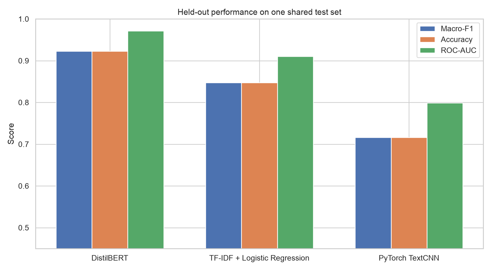
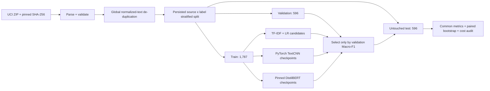

# Sentiment Classification: Traditional ML vs Deep Learning

[](https://github.com/hhhhollow/sentiment-ml-vs-transformers/actions/workflows/ci.yml)

An end-to-end, reproducible comparison of three text-classification rungs on one real public
dataset:

```text
TF-IDF + Logistic Regression  →  PyTorch TextCNN  →  pretrained DistilBERT
```

The point is not merely to use a Transformer. The project asks a more useful question: **how much
predictive quality does each rung add, and what does that improvement cost?** Every model receives
the same persisted train/validation/test IDs. Selection uses validation Macro-F1; the test set is
excluded until the final common evaluation.

## Measured answer

The table below comes from the committed full-run evidence, not illustrative values. The run used
2,979 prepared UCI sentences, an arm64 CPU, three DistilBERT epochs at most, and 1,000 paired
bootstrap resamples.

| Model | Val Macro-F1 | Test Macro-F1 (95% CI) | Accuracy | ROC-AUC | Dev time | Inference | Parameters | Artifact |
|---|---:|---:|---:|---:|---:|---:|---:|---:|
| DistilBERT | 0.9379 | **0.9228** [0.9025, 0.9428] | 0.9228 | 0.9711 | 200.15 s | 8.526 ms/item | 66,955,010 | 256.33 MiB |
| TF-IDF + Logistic Regression | 0.8456 | **0.8473** [0.8187, 0.8742] | 0.8473 | 0.9105 | 0.57 s | 0.031 ms/item | 47,232 | 1.27 MiB |
| PyTorch TextCNN | 0.7231 | **0.7164** [0.6810, 0.7514] | 0.7164 | 0.7989 | 6.61 s | 0.160 ms/item | 296,961 | 1.21 MiB |

The result has two distinct lessons:

- DistilBERT improves test Macro-F1 over TF-IDF by **+0.0755**. Its paired-bootstrap 95% interval
  is **[+0.0436, +0.1091]**, so the gain is stable on this test sample.
- The from-scratch TextCNN is **−0.1309** below TF-IDF, with interval
  **[−0.1694, −0.0940]**. A deep-learning framework is not itself an accuracy improvement; on a
  small corpus, sparse lexical features are a formidable baseline. TextCNN also uses **11.6×** the
  development time, **5.1×** the inference latency, and **6.3×** the parameters of TF-IDF while its
  serialized artifact is slightly smaller.

DistilBERT's gain costs about **351× downstream model-development time, 274× warm end-to-end inference latency,
1,418× parameters, and 201× artifact size** relative to TF-IDF on this machine. Upstream
pretraining compute and initial model download are excluded, making this a conservative lifecycle
cost comparison.




The complete interpretation, paired deltas, domain slices, calibration, and limitations are in the
[experiment report](reports/EXPERIMENT_REPORT.md).


## Experimental design



Leakage controls are explicit:

- The official archive and all three inner files must match pinned SHA-256 values.
- Duplicate keys use NFKC normalization, case-folding, and whitespace collapsing before splitting;
  21 duplicates are removed globally.
- Stable content-derived IDs and normalized text keys must be disjoint across splits.
- TF-IDF vocabulary, TextCNN vocabulary, and all learned weights fit train only.
- Nine traditional candidates and neural checkpoints are selected on validation only.
- All models use a fixed 0.50 decision threshold; the test set never tunes it.
- Model deltas use paired bootstrap rows because every model scores the same test sentences.

## Real public data

The project uses [UCI Sentiment Labelled Sentences](https://archive.ics.uci.edu/dataset/331/sentiment%2Blabelled%2Bsentences): 3,000 clearly positive or negative English review sentences
from Amazon, IMDb, and Yelp. Each source begins with 500 examples per class. The canonical UCI
record has DOI [10.24432/C57604](https://doi.org/10.24432/C57604) and a CC BY 4.0 license.

After verified parsing and global duplicate removal, 2,979 rows remain with a 49.95% positive rate.
Original review text stays in ignored local data files; version control contains aggregate evidence
and stable IDs, not the corpus. See the [data card](reports/DATA_CARD.md).

## What is implemented

### 1. TF-IDF + Logistic Regression

- Word unigrams, word (1,2)-grams, and combined word + character (3,5)-grams.
- `C ∈ {0.5, 1.0, 2.0}` for nine explicit candidates.
- Every candidate fits train only; validation Macro-F1 selects the artifact.
- The serialized joblib bundle includes the vectorizer pipeline and audit metadata.

### 2. Native PyTorch TextCNN

- Inspectable regex tokenizer and deterministic train-only PAD/UNK vocabulary.
- Learned embeddings; parallel Conv1d kernels of widths 3, 4, and 5; global max pooling;
  dropout; binary head.
- Explicit `Dataset`, collator, mini-batch loop, BCE-with-logits loss, AdamW, deterministic seeds,
  validation early stopping, and best-checkpoint restoration.
- Tensor-only safetensors weights plus JSON architecture and vocabulary files.

### 3. Pretrained DistilBERT

- [`distilbert/distilbert-base-uncased`](https://huggingface.co/distilbert/distilbert-base-uncased),
  Apache-2.0, pinned to immutable revision
  `12040accade4e8a0f71eabdb258fecc2e7e948be`.
- Explicit tokenization, DataLoader, optimizer steps, gradient clipping, validation checkpointing,
  safe serialization, checkpoint reload, and prediction code—no opaque one-line Trainer workflow.
- The model has about 67M parameters. Its inherited biases and unmeasured pretraining cost are
  stated rather than hidden.

## Metrics and cost scope

The primary metric is Macro-F1. Reports also include accuracy, balanced accuracy, macro precision
and recall, ROC-AUC, average precision, Brier score, log loss, ten-bin expected calibration error, confusion
matrices, and Amazon/IMDb/Yelp slices.

Development time uses the same boundary for every route: representation/tokenizer setup from the
validated split frames, model construction, candidate search or epoch optimisation, validation
selection, and serialization of the selected runnable artifact. Test evaluation, dataset download,
initial base-model download, and DistilBERT pretraining are excluded. The formal Transformer run
uses the verified local cache after a separate untimed asset-resolution step. Warm in-process
inference starts from raw text and includes vectorization/tokenization, batch construction, and
forward passes; it excludes loading artifacts from disk. Timings are hardware-specific and describe
orders of magnitude, not a universal leaderboard. Energy is not estimated without a trustworthy
power meter.


## Reproduce with uv

Requirements: Python 3.11–3.13 and [uv](https://docs.astral.sh/uv/).

```bash
git clone https://github.com/hhhhollow/sentiment-ml-vs-transformers.git
cd sentiment-ml-vs-transformers

UV_CACHE_DIR=.uv-cache uv sync --frozen --all-groups
UV_CACHE_DIR=.uv-cache uv run --frozen sentiment-benchmark run-all --device cpu
```

The first full run downloads the 82 KB UCI archive and the pinned DistilBERT base weights. A faster
integration run uses one Transformer epoch, two TextCNN epochs, and 50 bootstrap iterations:

```bash
make benchmark-fast
```

Useful commands:

```bash
make setup       # create/update .venv from uv.lock
make data        # download, hash-check, parse, de-duplicate, and validate UCI data
make benchmark   # execute the formal three-model experiment
make check       # Ruff + 40 tests + coverage threshold
```

## Batch inference

`examples/inference_sample.csv` shows the required input. It needs a `text` column;
`sentence_id` is optional but must be unique if supplied.

```bash
uv run --frozen sentiment-benchmark predict \
  --input examples/inference_sample.csv \
  --model distilbert \
  --device cpu \
  --output data/predictions/sentiment_predictions.csv
```

The same command supports `tfidf_logistic_regression` and `pytorch_textcnn`. Output contains IDs,
positive probabilities, binary labels, readable sentiment labels, and model name. It deliberately
omits raw input text. Saved artifacts must only be loaded from trusted sources.

## Evidence map

| Path | Evidence |
|---|---|
| `reports/model_comparison.csv` | Common validation, test, uncertainty, latency, size, and parameter metrics |
| `reports/paired_deltas_vs_tfidf.csv` | Paired Macro-F1 and accuracy differences with 95% intervals |
| `reports/source_metrics.csv` | Amazon, IMDb, and Yelp domain slices |
| `reports/model_disagreements.csv` | Test IDs where model predictions disagree; no review text |
| `reports/traditional_validation_search.csv` | All nine TF-IDF/LR candidate results |
| `reports/textcnn_history.csv` | From-scratch training and early-stopping history |
| `reports/distilbert_history.csv` | Fine-tuning and checkpoint-selection history |
| `reports/run_manifest.json` | Data/split hashes, exact config, model revision, runtime, and package versions |
| `reports/DATA_CARD.md` | Provenance, processing, license, and data limits |
| `reports/MODEL_CARDS.md` | Selection boundary, intended use, and model-specific risks |
| `reports/EXPERIMENT_REPORT.md` | Full measured interpretation and cost analysis |

Raw/processed text, Hugging Face cache, and model binaries are reproducible but intentionally
ignored by Git. Aggregated CSV/JSON/Markdown/PNG evidence is versioned.

## Repository structure

```text
src/sentiment_benchmark/
├── data.py               # pinned download, parsing, de-duplication, validation
├── splits.py             # shared source×label-stratified assignment contract
├── traditional.py        # TF-IDF + Logistic Regression search
├── textcnn.py            # native PyTorch model and training loop
├── transformer_model.py  # pinned DistilBERT fine-tuning loop
├── evaluation.py         # common metrics and paired bootstrap uncertainty
├── reporting.py          # figures, manifests, data/model cards, report
├── predict.py            # batch inference from all three artifact types
├── experiment.py         # one end-to-end orchestrator
└── cli.py                # download / prepare / run-all / predict
```

## Quality and reproducibility

- `uv.lock` resolves 74 packages; runs use `uv sync --frozen`.
- The verified local suite has 40 tests, 87.5% branch-aware coverage, and clean Ruff lint/format.
- Offline tests build a miniature local DistilBERT, so ordinary CI does not depend on Hugging Face.
- A manual GitHub workflow runs the full public-data benchmark and uploads reports/artifacts.
- The formal manifest records Python 3.13.14, PyTorch 2.13.0, Transformers 4.57.6,
  scikit-learn 1.9.0, the prepared-data hash, split-assignment hash, and Transformer revision.
- Deterministic settings reduce variation, but low-level kernels and different hardware can still
  introduce small numeric/timing differences.

## Limitations

- The dataset deliberately favors clear binary sentiment; neutral, mixed, multilingual, long-form,
  sarcasm-heavy, and recent distribution-shift examples are underrepresented.
- Random in-distribution splits do not establish future robustness or transfer to a new platform.
- Source slices are domains, not demographic fairness groups. No protected-attribute labels exist,
  so the project makes no demographic fairness claim.
- TextCNN and DistilBERT results are sensitive to small-data optimization choices. This benchmark
  fixes a defensible protocol; it is not an exhaustive neural architecture search.
- Predictive sentiment is not a safe basis for consequential decisions about people.

Released under the MIT License. Dataset attribution and model-license obligations remain separate;
see the data and model cards.
