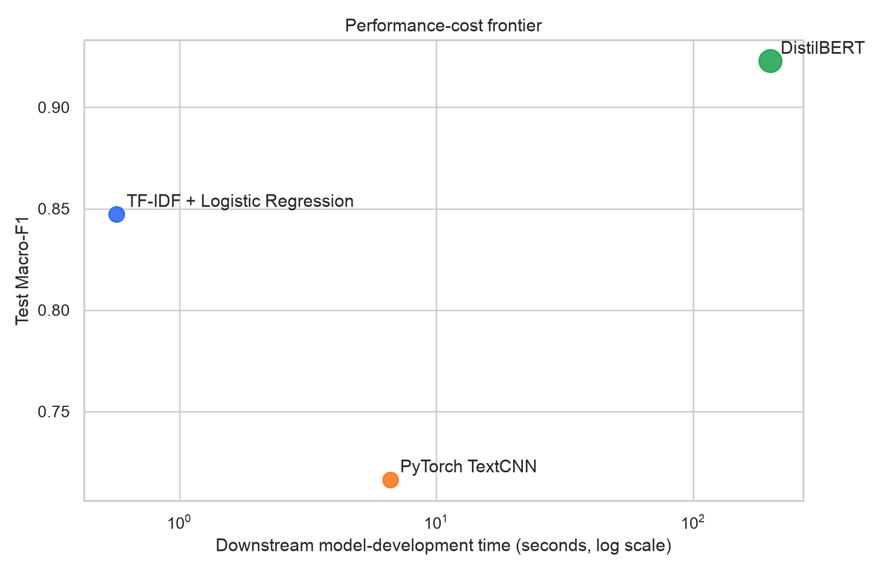
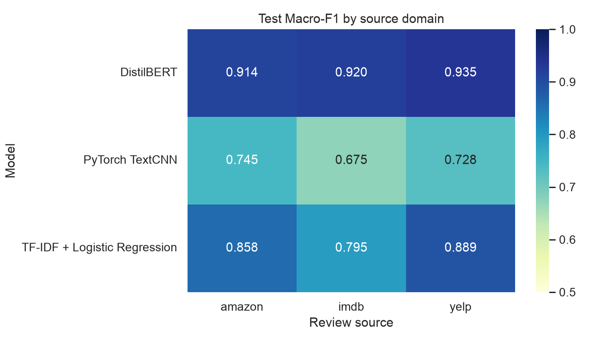
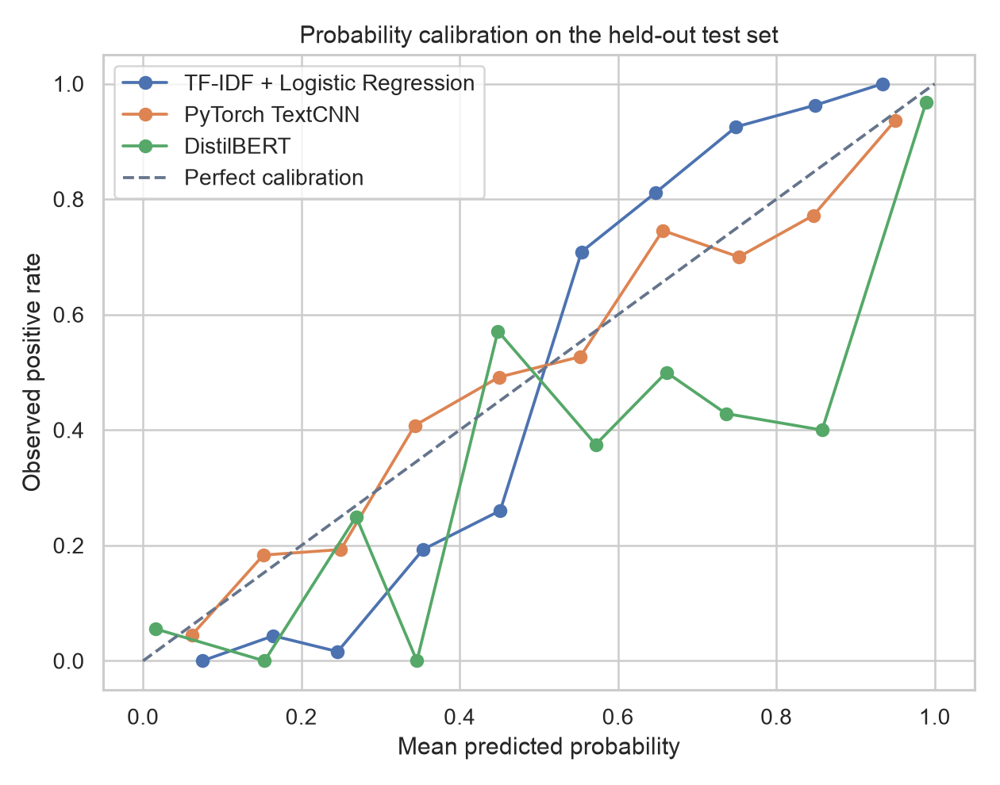
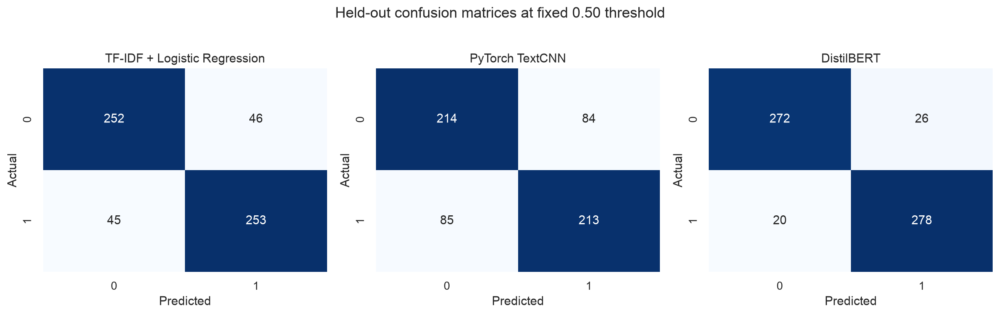

# Experiment Report: Traditional ML vs Deep Learning

## Executive answer

On the single untouched test set, **DistilBERT** was selected before test
evaluation because it had the highest validation Macro-F1. Its held-out Macro-F1 was
**0.9228** versus **0.8473** for the TF-IDF
baseline, a difference of **+0.0755**. That downstream result required roughly
**351.4x** the measured downstream model-development time and
**201.2x** the serialized artifact size of TF-IDF + Logistic Regression.

The paired-bootstrap 95% interval for DistilBERT's Macro-F1 improvement is
**[+0.0436, +0.1091]**. In contrast, the
from-scratch TextCNN reached **0.7164**, a paired difference of
**-0.1309**
**[-0.1694, -0.0940]** versus TF-IDF. The result
makes the central distinction concrete: using PyTorch alone did not improve quality on this small
corpus. The gain was observed on the pretrained-Transformer rung, which also changes architecture,
tokenizer, parameter count, and optimisation; this experiment does not isolate pretraining's causal
contribution.

TextCNN also required **11.6x** the downstream development time,
**5.1x** the warm inference latency, and
**6.3x** the parameters of TF-IDF while performing worse. Its serialized
artifact was slightly smaller, showing why artifact bytes alone are not a sufficient cost proxy.

| Model | Val Macro-F1 | Test Macro-F1 (95% CI) | Accuracy | ROC-AUC | Dev s | Infer ms/item | Params | Artifact MiB |
|---|---:|---:|---:|---:|---:|---:|---:|---:|
| DistilBERT | 0.9379 | 0.9228 [0.9025, 0.9428] | 0.9228 | 0.9711 | 200.15 | 8.526 | 66,955,010 | 256.33 |
| TF-IDF + Logistic Regression | 0.8456 | 0.8473 [0.8187, 0.8742] | 0.8473 | 0.9105 | 0.57 | 0.031 | 47,232 | 1.27 |
| PyTorch TextCNN | 0.7231 | 0.7164 [0.6810, 0.7514] | 0.7164 | 0.7989 | 6.61 | 0.160 | 296,961 | 1.21 |

The table is the measured answer, not an assumption that the Transformer must win. Confidence
intervals quantify finite-test uncertainty; paired deltas in `paired_deltas_vs_tfidf.csv` are the
right place to judge whether an apparent improvement is stable.

## Experimental protocol

- Dataset: UCI Sentiment Labelled Sentences, 2,979 prepared sentences from Amazon,
  IMDb, and Yelp; DOI `10.24432/C57604`, license CC BY 4.0.
- Cleaning: NFKC + case-fold + whitespace-normalised duplicate keys are removed globally before
  splitting (21 duplicate rows removed). Retained text is used for
  modelling after surrounding whitespace is stripped by the parser.
- Split: one persisted source×label-stratified train/validation/test assignment with
  1,787/596/596 rows. Every model receives
  the same IDs, and no normalised sentence crosses a split.
- Selection: candidates/checkpoints are chosen only by validation Macro-F1. Test labels never affect
  fitting, checkpoint selection, hyperparameters, or the champion; they are used only in the common
  final evaluation. Every classifier uses the same fixed 0.50 decision threshold.
- Uncertainty: 1,000 deterministic bootstrap resamples produce
  95% intervals; model-to-baseline deltas use paired row resamples.

## What each rung demonstrates

1. **TF-IDF + Logistic Regression** searches word unigram, word bigram, and word+character
   representations with three regularisation values. Vocabulary fitting stays inside train.
2. **PyTorch TextCNN** builds a train-only regex vocabulary, learned embeddings, parallel 3/4/5
   token convolutions, global max pooling, dropout, AdamW, and validation early stopping. Its
   training loop, checkpoint restoration, batching, and inference are implemented explicitly.
3. **DistilBERT** fine-tunes `distilbert/distilbert-base-uncased` pinned to immutable revision
   `12040accade4e8a0f71eabdb258fecc2e7e948be`. Tokenization, batching, optimizer steps, gradient clipping, validation
   checkpointing, safe serialization, and latency measurement are explicit PyTorch code.

## Domain robustness and error analysis

The lowest source-specific result was **0.6750** for
PyTorch TextCNN on **imdb**. Aggregate scores can therefore hide
meaningful domain variation even when every source is balanced. `source_metrics.csv` contains all
per-source metrics, while `model_disagreements.csv` records only IDs, labels, probabilities, and
predictions—no review text is copied into the versioned report.

| Model | Amazon | Imdb | Yelp |
|---|---:|---:|---:|
| TF-IDF + Logistic Regression | 0.8579 | 0.7949 | 0.8894 |
| PyTorch TextCNN | 0.7454 | 0.6750 | 0.7278 |
| DistilBERT | 0.9137 | 0.9200 | 0.9346 |

## Cost interpretation

Measured training cost uses one shared boundary: representation/tokenizer setup from validated split
frames, model construction, candidate search or epoch optimisation, validation selection, and
serialization of the selected runnable artifact. Test evaluation, dataset download, initial
base-model download, and DistilBERT pretraining are excluded. The formal Transformer run uses the
verified local cache after a separate untimed asset-resolution step. Timings are useful for
order-of-magnitude comparison on this machine, not as hardware-independent benchmarks. Energy and
carbon are not estimated because the project does not have a trustworthy power measurement.

Warm in-process inference timing starts from raw text and includes each model's tokenizer or
vectorizer, batch construction, and forward pass. It excludes reading model artifacts from disk.

## Limits and responsible use

- The source authors selected clearly positive/negative English sentences; neutral, mixed,
  long-form, multilingual, sarcasm-heavy, and contemporary distribution-shift cases are
  underrepresented.
- Random stratification tests in-distribution generalisation, not future or new-platform robustness.
- Confidence intervals resample rows from this one test split; they do not cover split-seed or
  training-seed variation.
- Review-source slices are domains, not demographic fairness groups. The dataset has no reliable
  protected-attribute annotations, so it cannot support a demographic fairness claim.
- Pretrained Transformers can inherit social bias from pretraining data. High aggregate sentiment
  accuracy does not make the system suitable for consequential decisions about people.
- The original review text is downloaded under CC BY 4.0 and remains uncommitted;
  derived aggregate evidence and stable IDs are versioned.
